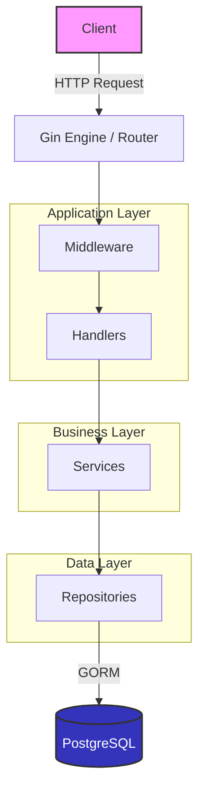
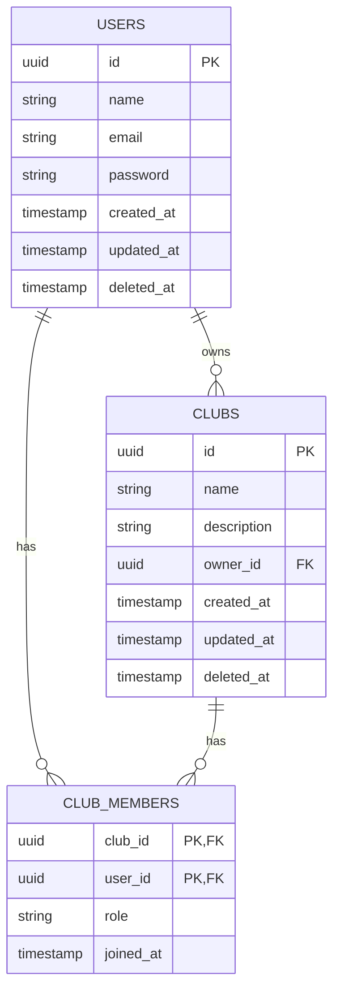

# Architecture Overview

CoolKit is built using a clean, layered architecture pattern in Go to ensure separation of concerns, testability, and maintainability.

## System Architecture



## Layer Descriptions

1. **Routing & Middleware (`cmd`, `internal/middleware`)**
   - **Responsibilities**: Route configuration, authentication checks, logging, CORS, panic recovery.
   - **Key files**: `cmd/server/main.go`, `internal/middleware/*.go`

2. **Handlers (`internal/handler`)**
   - **Responsibilities**: Parse incoming HTTP requests, validate input JSON, call the appropriate Service layer function, and format the HTTP response (JSON).
   - **Key files**: `internal/handler/*.go`

3. **Services (`internal/service`)**
   - **Responsibilities**: Core business logic. Where the "rules" of the application live. Does not know about HTTP (no `gin.Context`). Handles transactions if necessary.
   - **Key files**: `internal/service/*.go`

4. **Repositories (`internal/repository`)**
   - **Responsibilities**: Data access. Encapsulates database queries (using GORM). Keeps the Service layer agnostic of the specific database technology.
   - **Key files**: `internal/repository/*.go`

5. **Models (`internal/model`)**
   - **Responsibilities**: Domain entities and database schemas.
   - **Key files**: `internal/model/*.go`

## Data Flow: Creating a Club

1. **Client** sends `POST /api/v1/clubs` with JSON body.
2. **Gin Router** matches the path and passes it to the `AuthMiddleware`.
3. **Middleware** verifies the JWT token, extracts the user ID, and adds it to the request context.
4. **ClubHandler** receives the request, binds JSON to a struct, validates it, and calls `ClubService.CreateClub(ctx, ...)`
5. **ClubService** performs business logic (e.g., checking limits, assigning the user as owner) and calls `ClubRepository.Create(...)`.
6. **ClubRepository** uses GORM to execute an `INSERT` into the `clubs` table.
7. **ClubRepository** returns the created entity to the Service.
8. **ClubService** returns it to the Handler.
9. **ClubHandler** uses `pkg/response` to format a successful JSON response and sends it back to the Client.

## Database Schema



## Directory Structure

```text
.
├── cmd/
│   └── server/          # Main application entry point
├── docs/                # Project documentation
├── internal/
│   ├── config/          # Configuration loading (Viper)
│   ├── database/        # DB connection and setup
│   ├── handler/         # HTTP request handlers (Controllers)
│   ├── middleware/      # Gin middlewares (Auth, Logger, etc.)
│   ├── model/           # Domain models and GORM definitions
│   ├── repository/      # Data access layer interfaces and implementations
│   └── service/         # Business logic layer interfaces and implementations
├── pkg/
│   └── response/        # Standardized HTTP response helpers
└── scripts/
    └── seed/            # Database seeding utilities
```

## Key Design Decisions

- **GORM**: Chosen for developer productivity. It simplifies basic CRUD operations, provides an easy migration system, and handles associations well.
- **Layered Architecture**: Decouples business logic from HTTP transport, making it easier to test services independently of Gin, and repositories independently of services.
- **UUIDs**: We use UUIDs (v4) for primary keys instead of auto-incrementing integers. This makes IDs non-guessable, improves security, and simplifies distributed data generation.
- **JWT (JSON Web Tokens)**: Used for stateless authentication. It allows our API to scale easily without needing a centralized session store (like Redis) in the early stages.
